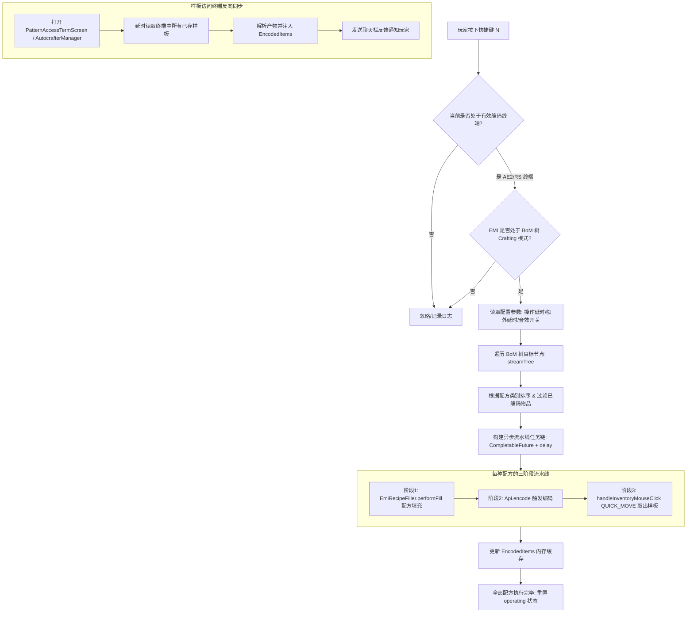

# 深入剖析 EMI-Patternizer：设计哲学、架构解析与技术启示录

> **项目背景**：`EMI-Patternizer` 是一个针对 Minecraft 1.21.1+ (NeoForge) 的纯客户端模组。它致力于解决自动化科技模组（如 Applied Energistics 2 与 Refined Storage）中**繁琐、重复且极易出错的样板（Pattern）手动编码工作**。通过将配方树（Recipe Tree / Bill of Materials）与样板终端深度打通，实现“一键批量编码数百个中间样板”的极致体验。

---

## 目录
- [一、核心精神与设计哲学 (The Core Philosophy)](#一核心精神与设计哲学-the-core-philosophy)
- [二、系统架构与数据流总览 (System Architecture)](#二系统架构与数据流总览-system-architecture)
- [三、关键技术模块深度拆解 (Technical Deep Dive)](#三关键技术模块深度拆解-technical-deep-dive)
  - [1. 触发与配方树拓扑遍历 (Recipe Tree Traversal)](#1-触发与配方树拓扑遍历-recipe-tree-traversal)
  - [2. 三阶段异步时序调度流水线 (Three-Phase Async Pipeline)](#2-三阶段异步时序调度流水线-three-phase-async-pipeline)
  - [3. 跨模组抽象与条件隔离 (Multi-Mod Abstraction Layer)](#3-跨模组抽象与条件隔离-multi-mod-abstraction-layer)
  - [4. 样板去重与终端记忆同步 (Memory & Deduplication System)](#4-样板去重与终端记忆同步-memory--deduplication-system)
  - [5. 防御性 GUI 交互与安全边界 (Defensive GUI & Mixin Guard)](#5-防御性-gui-交互与安全边界-defensive-gui--mixin-guard)
- [四、工程精妙之处与代码亮点 (Engineering Highlights)](#四工程精妙之处与代码亮点-engineering-highlights)
- [五、设计权衡与潜在改进空间 (Trade-offs & Limitations)](#五设计权衡与潜在改进空间-trade-offs--limitations)
- [六、对 JEI-Patternizer 的启示与开发蓝图 (Blueprint for JEI-Patternizer)](#六对-jei-patternizer-的启示与开发蓝图-blueprint-for-jei-patternizer)

---

## 一、核心精神与设计哲学 (The Core Philosophy)

### 1. 极致减负与自动化赋能 (Ultimate Quality of Life)
在大型科技模组整合包中（如包含 Powah, GregTech, EnderIO, Mekanism 等），制作一个终极物品往往需要几十甚至上百步多层嵌套的中间合成链。
* **传统痛点**：玩家需要不断在 EMI/JEI 查配方、手动点 `+` 号填入、点击“编码样板”、取下样板，机械重复上百次，耗费大量时间且极易遗漏关键中间产物。
* **核心精神**：**将人从繁琐重复的机械操作中解放出来**，将整个配方依赖树映射为自动化系统中的生产线规则。

### 2. 纯客户端合法交互 (Pure Client-side Elegance)
* 整个模组完全运行在**客户端 (Dist.CLIENT)**，无需服务端安装任何伴生模组。
* 不使用作弊或非法的底层数据包篡改，而是**精确模拟合法玩家的客户端交互行为**（配方填充 -> 点击编码 -> 快捷移动槽位取出），在多人联机服务器中具有极高的兼容性与安全性。

### 3. 低耦合的跨模组集成 (Decoupled Multi-Mod Compatibility)
* 不把逻辑强绑定在某一特定存储模组（AE2 或 RS）上，而是抽象出通用的协议接口（`Api`），支持优雅扩展。
* 巧妙利用 Mixin Plugin 与动态反射类检查，保证在仅安装部分前置或依赖缺失时**零崩溃、静默适配**。

### 4. 状态记忆与智能增量 (Smart Deduplication & Cache Sync)
* **避免无谓浪费**：自动识别已编码过的物品产物，跳过已有配方，避免浪费珍贵的空白样板。
* **状态互通**：支持通过打开样板访问终端反向读取网络中已存在的样板，实现增量补全而非全量覆盖。

---

## 二、系统架构与数据流总览 (System Architecture)



---

## 三、关键技术模块深度拆解 (Technical Deep Dive)

### 1. 触发与配方树拓扑遍历 (Recipe Tree Traversal)
**核心类**：`Patternize.java`
* **配方树流式展开 (`streamTree`)**：
  ```java
  public static Stream<MaterialNode> streamTree(MaterialNode node) {
      if (node == null) return Stream.empty();
      return Stream.concat(
          Stream.of(node),
          node.children == null ? Stream.empty() : node.children.stream().flatMap(Patternize::streamTree)
      );
  }
  ```
  通过递归扁平化 EMI 的 `MaterialNode` 树，将整棵多叉合成树转换为一维流。
* **类别聚类排序 (`sorted`)**：
  通过 `Comparator.comparing(node -> node.recipe.getCategory().id.toString())`，将相同分类/工作台类型的配方聚类在一起，确保处理流水线的有序性。
* **已编码过滤 (`containsAllItems`)**：
  提取配方 `recipe.getOutputs()`，检查其产物 ID 是否已全包含在 `EncodedItems` 集合中，若已存在则直接过滤。

---

### 2. 三阶段异步时序调度流水线 (Three-Phase Async Pipeline)
**核心函数**：`Patternize.Encode`

在多人联机或 Minecraft 客户端网络架构下，GUI 操作、数据包往返与服务端校验需要一定的时间差。直接同步循环执行会导致数据包乱序、槽位未刷新、样板覆盖失败等问题。

`EMI-Patternizer` 采用了精巧的**级联异步延时调度器**：
```java
// 初始延时 initDelay
CompletableFuture.delayedExecutor(initDelay, TimeUnit.MILLISECONDS).execute(() -> {
    // 1. 在主线程执行配方填充 (Fill)
    minecraft.execute(() -> {
        boolean fillResult = EmiRecipeFiller.performFill(recipe, screen, EmiCraftContext.Type.FILL_BUTTON, EmiCraftContext.Destination.NONE, 1);
        if (isPlaySound && fillResult) {
            minecraft.getSoundManager().play(SimpleSoundInstance.forUI(SoundEvents.UI_BUTTON_CLICK, 1.0f));
        }
    });

    // 2. 延时 delayPerOperation 后触发样板编码 (Encode)
    CompletableFuture.delayedExecutor(delayPerOperation, TimeUnit.MILLISECONDS).execute(() -> {
        minecraft.execute(() -> {
            api.encode(isSimulateClick);
        });

        // 3. 延时 delayPerOperation 后将编码完成的样板 Shift 点击移入玩家背包 (Quick Move)
        CompletableFuture.delayedExecutor(delayPerOperation, TimeUnit.MILLISECONDS).execute(() ->
            minecraft.execute(() ->
                gameMode.handleInventoryMouseClick(
                    menu.containerId,
                    encodedPatternSlot,
                    0, // 0 = Left Click
                    ClickType.QUICK_MOVE,
                    player
                )
            )
        );
    });
});
```

* **时序增量计算**：每个配方耗费的完整时序为 `3 * delayPerOperation + delayAdditionalPerPattern`，通过 `AtomicLong maxDelay` 线性累加，保证成百上千个配方按部就班、串行且安全地执行完毕。

---

### 3. 跨模组抽象与条件隔离 (Multi-Mod Abstraction Layer)
**核心接口**：`io.github.linkfgfgui.emi_patternizer.intergrated.Api`

```java
public interface Api {
    void encode(boolean isSimulateClick);
    int getEncodedPatternSlot();
    long getPatternCount(Level level);
    
    static Api getApi(AbstractContainerScreen<?> screen);
    static boolean isValidEncodingScreen(Screen screen);
    static boolean isValidAccessScreen(Screen screen);
}
```

* **安全类型匹配 (`isInstanceOf`)**：
  为避免直接在代码中引用可能未安装的类（如未装 AE2 或 RS 导致 `NoClassDefFoundError`），使用带缓存的 `Class.forName(className)` 机制进行软匹配。
* **AE2 集成 (`appliedenergistics2.java`)**：
  * 通过 `PatternEncodingTermMenu.encode()` 或模拟按钮点击触发编码。
  * 利用 `AEBaseMenuAccessor` 抓取 `SlotSemantics.ENCODED_PATTERN` 对应的物理槽位索引。
  * 读取 `PatternAccessTermScreen` 中的 `PatternContainerRecord`，使用 `PatternDetailsHelper.decodePattern(item, level)` 解析输出产物。
* **Refined Storage 集成 (`refinedstorage.java`)**：
  * 通过 `PatternGridContainerMenuAccessor.invokeSendCreatePattern()` 或模拟按钮点击触发编码。
  * 获取 `PatternGridContainerMenu.getPatternOutputSlot()` 槽位。
  * 通过 `RefinedStorageApi.INSTANCE.getPattern(item, level)` 解析 RS 样板内部产物。

---

### 4. 样板去重与终端记忆同步 (Memory & Deduplication System)
**核心类**：`ReloadMemory.java`

* **被动监听同步**：当玩家打开 AE2 的“样板访问终端 (Pattern Access Terminal)”或 RS 的“自动合成器管理器 (Autocrafter Manager)”时，触发 `ScreenEvent.Opening` 事件。
* **延时读取机制**：等待 `delayBeforeRead`（默认 1000ms）确保服务端已将所有样板数据完整同步到客户端 Screen / Container 后，调用 `api.getPatternCount(level)` 遍历终端槽位。
* **自动记忆加载**：解析出的所有成品物品 ID 写入 `EncodedItems` 集合，并在聊天栏输出友好提示：
  > `从 X 个样板中加载了 Y 种物品`

---

### 5. 防御性 GUI 交互与安全边界 (Defensive GUI & Mixin Guard)
* **防误触中断 (`AbstractContainerScreenMixin`)**：
  ```java
  @Inject(method = "onClose", at = @At("HEAD"), cancellable = true)
  private void preventScreenClose(CallbackInfo ci) {
      Screen currentScreen = (Screen) (Object) this;
      if (Api.isInstanceOf(currentScreen, "appeng.client.gui.me.items.PatternEncodingTermScreen") && Patternize.operating) {
          ci.cancel();
      }
  }
  ```
  在批量编码进行中（`Patternize.operating == true`），主动拦截玩家误按 `ESC` 或关闭界面操作，避免数据流水线被强行打断导致状态混乱。
* **条件 Mixin 插件 (`MixinPlugin`)**：
  通过 `IMixinConfigPlugin.shouldApplyMixin` 检测模组加载状态（`ae2` / `refinedstorage`），按需应用 Accessor，绝不污染无关类环境。

---

## 四、工程精妙之处与代码亮点 (Engineering Highlights)

| 设计维度 | 实现手段 | 带来的核心价值 |
| :--- | :--- | :--- |
| **线程安全与 GUI 渲染** | `CompletableFuture` + `Minecraft.getInstance().execute(...)` | 既利用了后台线程做非阻塞时钟调度，又保证所有与 Minecraft 世界/GUI/网络相关的交互安全地切回客户端主线程执行。 |
| **优雅的软依赖兼容** | 字符串反射缓存 + `IMixinConfigPlugin` 条件加载 | 统一代码库同时适配 AE2 和 RS，任何一个模组缺失都不会造成崩溃。 |
| **极简的用户交互路径** | 单一热键触发 + 自动识别 BOM 树上下文 | 玩家无需繁琐配置，只需在 EMI 打开树并按键，一键成型。 |
| **状态闭环与反馈** | UI 按钮音效、聊天栏重载统计、操作锁定标志位 | 具备清晰的听觉/视觉交互反馈，杜绝重复连击与并发冲突。 |

---

## 五、设计权衡与潜在改进空间 (Trade-offs & Limitations)

1. **固定延时流水线 vs 响应式事件确认 (Fixed Delay vs Event-Driven ACK)**
   * *现状*：当前版本采用固定的时间延迟（默认单步 60ms，总步长累加）。
   * *局限*：在网络波动较大、高 Ping 服务器或低帧率环境下，可能出现某一步骤尚未被服务端确认即触发下一步，导致漏做或失败；而在本地单人游戏中，固定延时又显得略有保守。
   * *优化方向*：引入槽位监听（Slot Content Change Listener），在检测到样板输出槽出现编码样板后再动态推进下一步。

2. **异常情况中断与恢复 (Error Handling & Graceful Abort)**
   * *局限*：如果在流水线执行中途，**空白样板耗尽**或**玩家背包已满**，当前逻辑仍会继续遍历后续配方并尝试填充。
   * *优化方向*：在每个步骤前加入前置检查（如空白样板槽 `stack.getCount() > 0` 且背包有空位），若不足则立即中断并弹出警告 Toast。

3. **复杂输出物支持 (Fluids, Chemicals, Tags)**
   * *局限*：目前逻辑主要聚焦于标准物品 `ItemStack`，对部分模组中的流体样板（Fluid Pattern）或气体/化学品样板的容错与支持仍有扩展空间。

---

## 六、对 JEI-Patternizer 的启示与开发蓝图 (Blueprint for JEI-Patternizer)

如果你正在开发或计划开发 **`JEI-Patternizer`**（基于 Just Enough Items 的同类实现），EMI-Patternizer 的架构设计提供了极具价值的参考范本：

### 1. 架构映射与差异对比

```
+-------------------------------------------------------------------------------+
|                                JEI-Patternizer                                |
+-------------------------------------------------------------------------------+
|  1. 配方树与依赖解析 (DAG Dependency Engine)                                   |
|     - JEI 原生缺乏全局 BoM 树:                                                |
|       方案 A: 递归查询 RecipeManager 构建配方依赖图 (拓扑排序)                  |
|       方案 B: 与 Just Enough Calculation / JEI Recipe Tree 等计算模组联动      |
+-------------------------------------------------------------------------------+
|  2. 配方转移与填充 (Recipe Transfer Layer)                                     |
|     - 适配 IRecipeTransferHandler 与 AE2/RS 原生注册的 JEI 转移逻辑            |
|     - 模拟 JEI '+' 按钮的 RecipeTransferOperations                            |
+-------------------------------------------------------------------------------+
|  3. 跨模组抽象与编码调度 (Abstract Api & Timed Pipeline)                       |
|     - 完全复用 Api 抽象设计 (AE2 / RS / ExtendedAE / Occultism / ...)        |
|     - 采用更为健壮的状态机 (State Machine) 进行异步步骤调度                     |
+-------------------------------------------------------------------------------+
|  4. 样板记忆与反向同步 (Pattern Cache & Deduplication)                          |
|     - 继承 ReloadMemory 机制: 打开终端自动解析已有样板                         |
+-------------------------------------------------------------------------------+
```

### 2. 核心研发阶段规划

#### 阶段一：配方依赖拓扑解析器 (Recipe Tree Builder)
* 实现一个递归的 `RecipeDependencyTree`：给定目标 `ItemStack`，在客户端配方库中反向解析子配方，处理循环依赖与多重配方歧义选择。

#### 阶段二：JEI Recipe Transfer 适配
* 深入调用 JEI 的 `IRecipeTransferHandlerHelper` 与 AE2/RS 的 `JEIRecipeTransferHandler`，将计算出的配方结构自动填入编码终端。

#### 阶段三：调度状态机与鲁棒性增强
* 实现 `PatternizerStateMachine`：
  * `IDLE` -> `FILLING` -> `WAIT_ENCODED` -> `MOVING` -> `NEXT`
  * 加入空白样板检查、背包容量监控、网络超时自动重试与取消机制。

#### 阶段四：UI 增强与交互体验
* 在 JEI 界面增加“批量编码”专用按钮与浮窗，显示实时进度条、剩余空白样板预估与耗时统计。

---

## 总结

`EMI-Patternizer` 展现了优秀的 Minecraft 客户端辅助模组工程素养：**以极简的代码量（不到 1000 行），精准直击玩家自动化痛点，并通过严谨的异步时序调度与跨模组抽象，实现了安全、稳定、丝滑的批量操作体验**。这一架构与思路，正是所有配方自动化与 QoL 模组开发的典范标杆。
